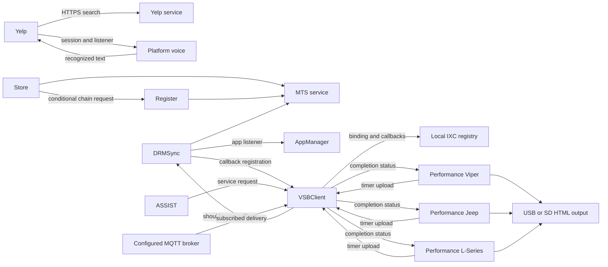

# KIM19 application and service relationships

**PROVED static relationships; UNKNOWN target activation.** The deterministic
[graph JSON](../reports/kim19_runtime_analysis/application_service_graph.json)
contains all nine application identities, seven service/output nodes and 23
reviewed relationships. Every relationship binds an exact source JAR, class,
method descriptor, bytecode offset, callee descriptor and source hashes.
The generator rejects mismatching evidence. Conditions are reviewed
interpretations; it does not calculate runtime reachability from syntactic calls.

**PROVED:** the native launch/catalog path common to these apps is documented
in the [runtime observation model](kim19_runtime_observation_model.md). Native
manual launch performs its authorization step before the AMS handoff; the
visibility result is a separate cached property. Background startup has global
and launcher gates. The graph does not duplicate these as nine invented direct
Java calls. Recovered appManager configuration names VSB and DRM as required
UUIDs and DRM as a delayed-start app; declared configuration is not observed
execution.

| Relationship | PROVED concrete evidence | Condition / limit |
|---|---|---|
| Store requests Register launch | `StorefrontXlet$1.run`: Register UUID literal BCI3, `AppManager.chain(String)` BCI5 | Store account validation/confirmation branch; native chain/AMS authorization still separate |
| Yelp voice to search | Session listener registration BCI331; `VRHelperImp$1.run` callback BCI21; `SpeechListener` request BCI58/63 | Current action, non-cancel recognized text, session/service and HTTPS gates |
| Store/Register/DRM to MTS | Each package's constructed request reaches its own `BaseRequest.CallService`, HTTP execute BCI53; MTS resource values are separately hashed | Duplicate client classes do not establish a shared client object or shared account acceptance |
| DRM to VSB | Locator lookup25, callback rebind87, callback-name registration98 | Running authorized daemon and registry binding |
| VSB to DRM | Generic/configured routing to `IxcFromVSB`; recipient `VSBEventHandlerListener.notify` pending73 or process91 | Matching event and processing state; update/sync behavior is outside the operator procedure |
| ASSIST to VSB | `AssistCommunicationManager.process` sends at BCI119 | Service action can place a call; do not invoke merely to observe a daemon |
| VSB to ASSIST | Callback registration exists; all three ASSIST notification bodies are empty | No observable notification effect is established by these callbacks |
| Performance to VSB | Timer UI -> SDP exception fallback -> callback registration -> callable send37 | All variants have concrete code; wrong line, launch grant, absent VSB or configuration can block it |
| VSB to Performance | MQTT action completion -> local callback -> latch -> view status | Success can mean MQTT delivery, not website persistence; no arbitrary remote sender established |
| Performance to media | Save enum -> generated HTML -> `Writer.write` BCI26 | Media must be mounted/writable; writes are not part of the read-only checklist |

**PROVED:** there are concrete local lookup mechanisms and shared platform
services. **UNKNOWN:** current registry contents, bindings and caller authority.
Binding names are local Java remote identifiers, not hostnames or open ports.
The real radio may expose a different installed subset or version than the
complete recovered package.

**PROVED:** several apps load MTS settings or use RMS and account/subscriber
objects. **UNKNOWN:** identical class names or RMS store names across JARs do
not establish the same live object, shared persistent namespace, cross-Xlet
access or synchronized cache. The graph therefore represents the proven
request/callback relationships and retains those storage/authentication limits.
Yelp's mandatory dependence on an active VSB binding is not established by its
traced direct HTTPS search path.

**TARGET OBSERVATION REQUIRED:** ordinary UI can support app execution or a
particular operation, but usually cannot uniquely attribute a dependent screen
to a daemon. A timer upload status is weaker than proof that a backend saved
the result. A missing background tile proves no missing daemon. Use the
[observation checklist](target_observation_checklist.md) before selecting any
further interaction.
