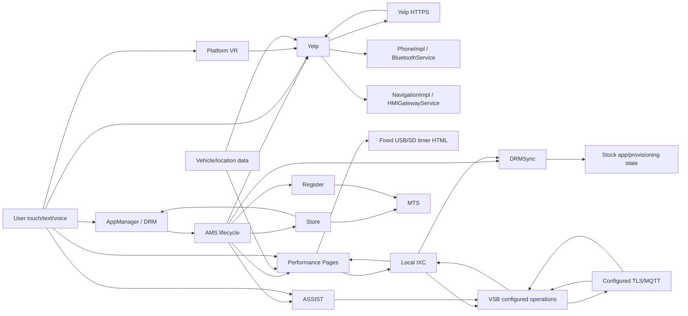

# KIM19 stock-signed capability graph

This is the final cross-application handoff/taint graph for recovered KIM19 selected by part `68224525AM`. The canonical node/edge ledger is [handoff_graph.json](../reports/kim19_final/handoff_graph.json). Every edge below is a recovered static path; target installation, grants, service liveness, and backend acceptance remain **TARGET OBSERVATION REQUIRED** where stated.

## Graph

The diagram intentionally has no edge from USB/SD, HTTP data, IXC, or VSB to a class loader, script engine, process launcher, SocketCommandSource, or arbitrary application identifier. No such receiver chain is established in current KIM19.

## Closed handoff paths

| Input | Stock application | Handoff/receiver | Action | Ceiling | Static result |
|---|---|---|---|---:|---|
| Touch/category/text or recognized speech; platform location | Yelp | Direct HTTPS client -> parsed `Place` models -> stock LWUIT screens | Search/results/details | L2 | **PROVED**; network/backend runtime state unobserved |
| Selected Yelp result | Yelp | `PhoneImpl` -> `BluetoothService.dial` | Typed dial request | L3 | **PROVED** receiver chain; phone/pairing/runtime **TARGET OBSERVATION REQUIRED** |
| Selected Yelp result/geocode | Yelp | `NavigationImpl` -> `OpenNavActivation` -> `HMIGatewayService.routeToLocation` | Typed route request | L3 | **PROVED** receiver chain; navigation runtime **TARGET OBSERVATION REQUIRED** |
| Apps selection or fixed Register GUID | Apps UI / Store | AppManager/DRM -> AMS | Launch an already-installed authorized app | L3 | **PROVED** static route; current catalog/grant/runtime **TARGET OBSERVATION REQUIRED** |
| Timer/vehicle state and save choice | Performance Pages | Direct `java.io` writer | Fixed-destination generated timer HTML | L2 | **PROVED**; no KIM19/common-base consumer proved |
| Timer/vehicle state and upload choice | Performance Pages | SDP exception fallback -> VSB IXC -> configured MQTT -> IXC callback | Fixed-schema upload plus delivery status | L3 | **PROVED** static route; not general messaging and not backend-persistence proof |
| Catalog/account response and user confirmation | Store | MTS client; fixed `AppManager.chain(Register GUID)` | Stock catalog UI or Register launch | L3 | **PROVED**; account/backend and target authorization unobserved |
| Registration/account response | Register | MTS client | Stock provisioning/UI state | L3 | **PROVED**; state-changing and target-dependent |
| User assistance choice | ASSIST | VSB/platform call interfaces | Stock assistance communication/call | L3 | **PROVED**; not a benign daemon probe |
| Authenticated configured broker data | VSBClient | Exact topic/operation task -> IXC callback | Recipient-specific stock action | L3 | **PROVED** configured path; arbitrary sender/caller/operation authority not proved |
| Matching VSB callback/MTS state | DRMSync | IXC/AppManager/listeners | Grant/sync/reset/install-related stock state | L3 | **PROVED** static path; excluded from passive/local closure observations |

## IXC disposition

**PROVED:** VSBClient rebinds `VSB:com.sprint.chrysler.vsbclient.ixc.VSBClient`. DRMSync, ASSIST, and all three Performance Pages variants have concrete locator/callback consumers. VSB enumerates registry names, resolves configured callback remotes, and invokes `IxcFromVSB` methods. DRMSync also enumerates and calls bound DRM notification listeners.

**PROVED:** receiver bodies constrain the effect. DRMSync can queue stock processing; ASSIST's three incoming notification bodies are empty; Performance success/failure releases a latch and updates stock status. A shared interface name does not imply a shared effect.

**PROVED:** Yelp obtains an `IxcRegistry` handle but has no recovered `bind` or `lookup` call. No IXC edge reaches an inbound socket, command loop, class loader, script engine, process launcher, arbitrary app launch, or removable-media consumer.

**UNKNOWN:** current bindings, remote liveness, and effective caller permissions. IXC names are local Java remote identifiers, not hostnames or open ports. The useful final disposition is a typed Level-3 stock service bus, not Level-4 generalized authority.

## Configuration and generalized dispatch

VSB's three-string interface is structurally broad, but the implementation performs exact lookup in a daemon-owned finite operation set. Performance Pages fixes operation `gskills`, callback behavior, and its two-field timer payload. No KIM19 path lets a user add an operation, choose an arbitrary broker route, install a handler, or supply class bytes. This remains Level 3.

The only proved generalized method selector is Tweddle JSON `invoke` in five older app copies from KIM1/KIM3/KIM12. The recovered installer never selects those packages for any shipped map entry, and KIM19 Yelp is a different implementation without the framework. That Level-4 path is therefore historical and conditional, not a KIM19 graph edge.

## Data interpretation rules

- A string or model remains data unless a recovered receiver interprets it as a typed action, command, class, script, or process.
- HTML generated by Performance Pages is an output document. No recovered KIM19/common-base consumer interprets it.
- Yelp response fields populate `Place` models and widgets. Only explicit user actions cross into typed phone/navigation services.
- VSB accepts daemon-configured operations; the public method signature alone does not establish arbitrary caller or operation authority.
- A static sender/receiver path does not prove current target activation, permission, service state, network trust, or backend acceptance.

## Coverage boundary

The synthesis binds the 37-file KIM19 package, all 19 JARs, 4,572 class entries, the 23-edge reviewed application/service graph, the complete Yelp receiver reports, the Performance Pages producer/consumer reports, and the 300-JAR stock-signed socket/dynamic follow-up. Scoped negatives do not claim absence from unrecovered native/AOT code or a radio's historical mutable installation state.
