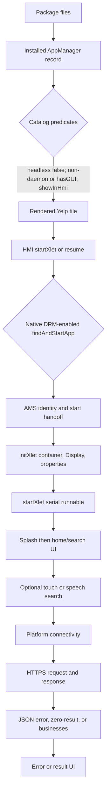

# Yelp launch gate model

**PROVED static scope:** recovered KIM19 Yelp 03.00.33, app ID
`1D5347C0-8B5E-11E2-9E96-0800200C9A66`, main class
`com.sprint.chrysler.yelp.xlet.YelpPOIXlet`, Yelp JAR SHA-256
`f05efd2048577c5c5b32532ff9a46a8f42a31e0508946b072d337ab2077b3282`,
and recovered production HMI/AppManager/AMS artifacts. **UNKNOWN:** whether the
radio currently has that exact identity, state, or backend access.

## Gate ledger

| Gate | Static evidence | Success establishes | Failure or observation limit |
|---|---|---|---|
| Physical membership | KIM19 descriptor and Yelp executable/key resources agree on identity/version | **PROVED:** files existed in the recovered package | **UNKNOWN:** current installation record or target hash |
| Native registration | recovered install completion feeds the AppManager installed-object map and persistence | **INFERRED:** a matching object can participate in enumeration | package membership alone does not establish registration |
| Catalog inclusion | `getAppListByHmiCategory` requires `!headless && (!daemon || hasGUI) && showInHmi`; category branch also matters | **PROVED:** a returned entry passed those tests in that call | absence cannot isolate a field, category, or stale-list cause |
| HMI rendering | Apps/MainSupplement turn returned properties into an Applet | **INFERRED:** a visible matching tile crossed enumeration/rendering | tile name does not establish exact JAR identity |
| Selection/resume | Apps `onItem` calls `startXlet`; an already-running app can use a resume path | **PROVED:** a tap dispatch exists | visible UI may be resumed rather than freshly initialized |
| Native authorization | `startApp` enables DRM checking at file `0x50650` and calls `findAndStartApp` at `0x5066c` | **INFERRED:** successful handoff crossed native resource/authorization checks | a tile does not prove DRM, resource capacity, or AMS availability |
| AMS association | AppManager passes the registered identity/main/key/payload relationship to AMS | **INFERRED:** AMS accepted a matching start request | request does not prove `initXlet` completion |
| Xlet init | `initXlet`: registry BCI23, container52, visible60, Display64, properties85/101, platform info140 | **PROVED:** these operations precede ordinary start UI | container exception handler173 calls `destroyXlet(true)` at 208; generic exception handler214 is distinct |
| Xlet start | `startXlet` checks `started` at BCI9 and queues the serial runnable at 23 | **INFERRED:** scheduling succeeded | scheduling does not prove the runnable or splash became visible |
| Splash/home | serial runnable applies themes/resources, shows `YelpSplashScreen` at BCI38; later worker/callback selects the home screen | **INFERRED:** stable home means sufficient UI initialization completed | splash can fail or stall before home without any request |
| Location and speech | touch search uses platform location; VR uses a platform session and recognized text callback | **INFERRED:** only the observed input path crossed its local gates | microphone, VR service, location, and permissions remain independent |
| Connectivity | common `BaseRequest.run` calls `establishConnectivity` before the request | **INFERRED:** a later relevant response crossed a usable route | UI or local error does not prove a network attempt |
| HTTPS/backend | `CallService` uses `DefaultHttpClient`, executes the created request, obtains status, and may return null on Throwable | **INFERRED:** response-dependent relevant results support TLS/HTTP/backend completion | generic failure cannot distinguish route, DNS, TLS, HTTP, credential, or parsing |
| Response mapping | `GpSearchRequest.processJSONObject` separates `error`, empty businesses, and parsed business lists | **PROVED:** distinct status and data paths exist | packaged error text alone does not prove which path ran live |

## Candidate gates searched

**PROVED:** the Yelp descriptor supplies screen/category, language names,
pause/VR/TTS declarations, icons, main class, version, and `daemon=false`.
No Yelp `xlet.showConditions` property is present. **PROVED:** locale bundles
exist for `en_US`, `es_MX`, and `fr_CA`; choosing a bundle changes text rather
than establishing a catalog-time locale gate.

**PROVED:** targeted class/resource review found no Yelp-owned registration
screen class, subscriber-state lookup, vehicle-line predicate, Store launch,
Register launch, DRM API call, VSB IXC binding, or super-app check before Yelp
home. **UNKNOWN:** this scoped negative result does not exclude platform-native
or server-side policy after launch. An observed registration/subscription screen
therefore requires exact text and ownership correlation.

**PROVED:** Yelp does use platform services later: location, phone/navigation
actions, VR, and common connectivity. Their failure resources include GPS,
Bluetooth phone, navigation activation, communication, and service errors.
They are action-dependent gates, not evidence that every one must succeed for
the home screen.

## Observation boundaries

- **TARGET OBSERVATION REQUIRED:** outcome A requires all relevant pages to be
  recorded; a partial page survey is outcome H.
- **TARGET OBSERVATION REQUIRED:** outcome C records whether a splash appears
  and whether the radio returns to the prior screen, without repeated launch.
- **TARGET OBSERVATION REQUIRED:** outcome D includes the exact title/body and
  preceding ordinary action; the [failure report](../reports/kim19_runtime_analysis/yelp_failure_signatures.json)
  can then match packaged strings.
- **TARGET OBSERVATION REQUIRED:** outcome E stops at recording the screen; no
  registration, purchase, acceptance, or account change is part of the model.
- **TARGET OBSERVATION REQUIRED:** a stable home is outcome F. Outcome G requires
  an already observed ordinary search with relevant results and an explicit
  statement that the documented flow worked.

The deterministic interpretation rules are in
[the target observation analysis](yelp_target_observation_analysis.md).
